# catppuccin-dotfiles
Dotfiles for my Catppuccin Mocha Rice

## gnome (before I revamped the top bar and control center)
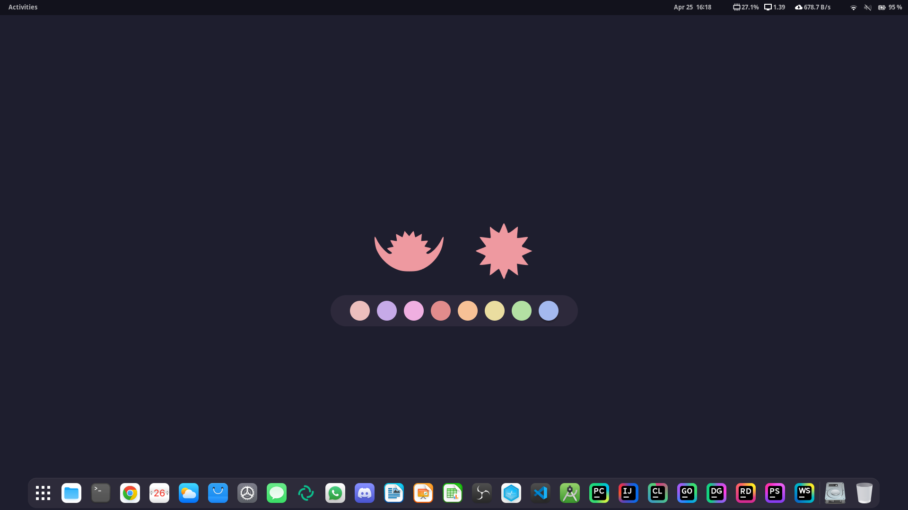
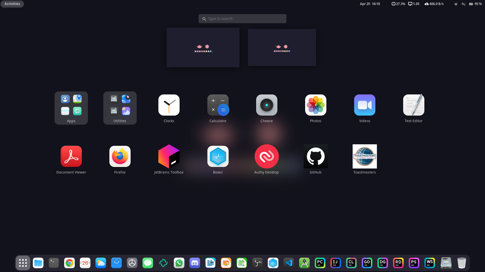
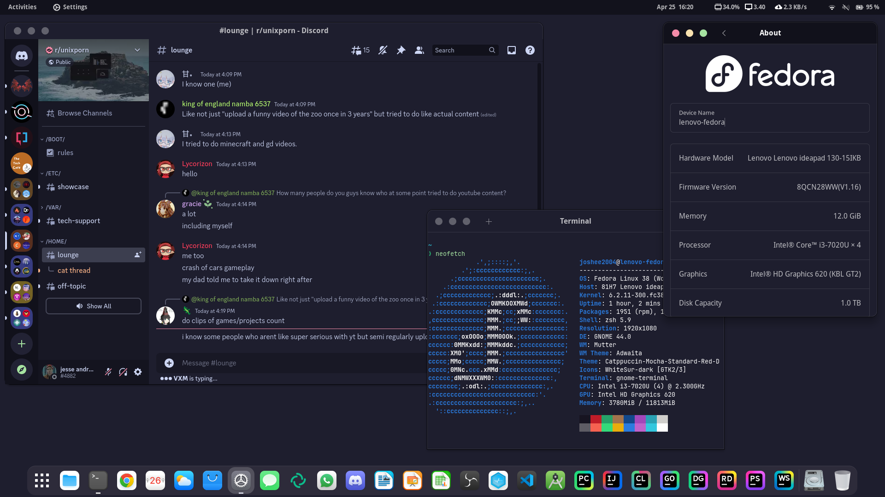
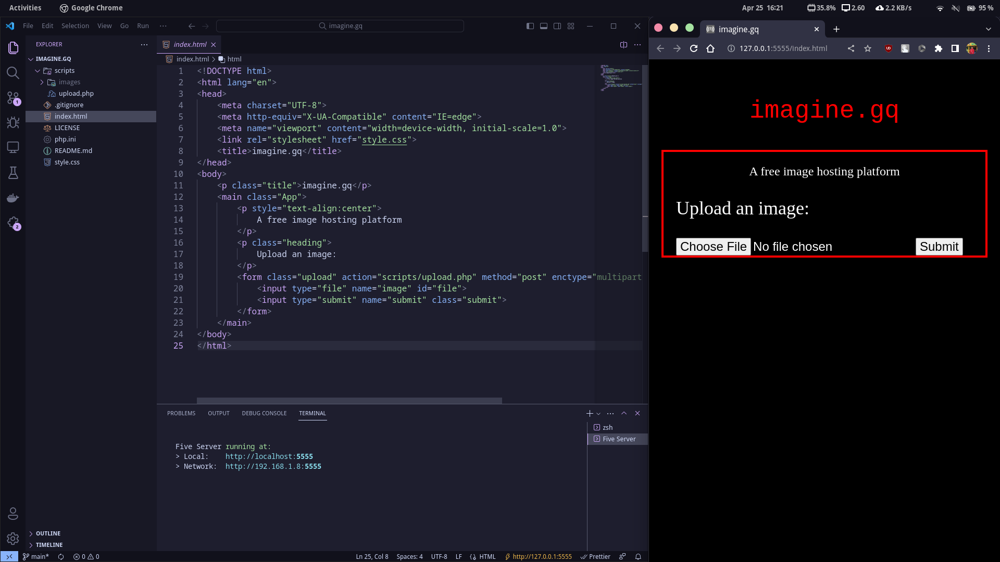
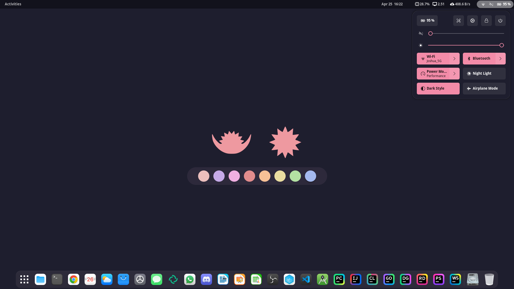
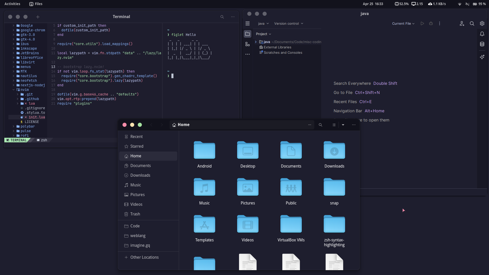

## gnome (after I revamped the top bar and added control center)
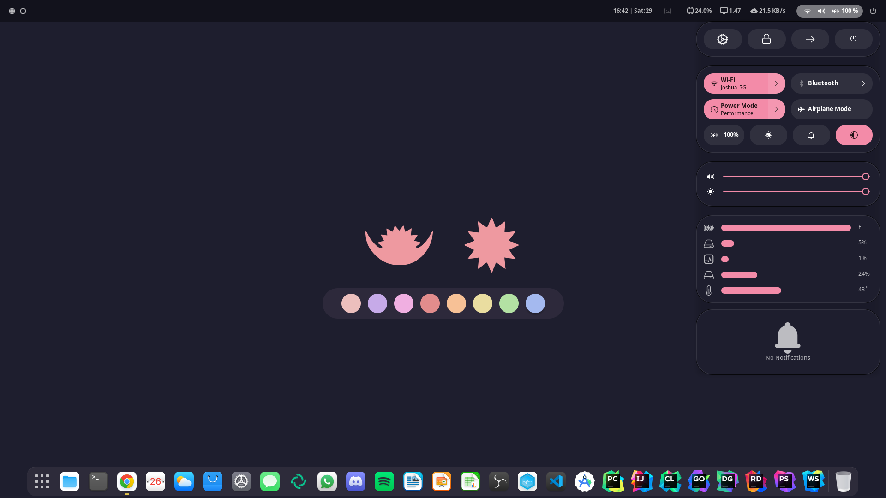
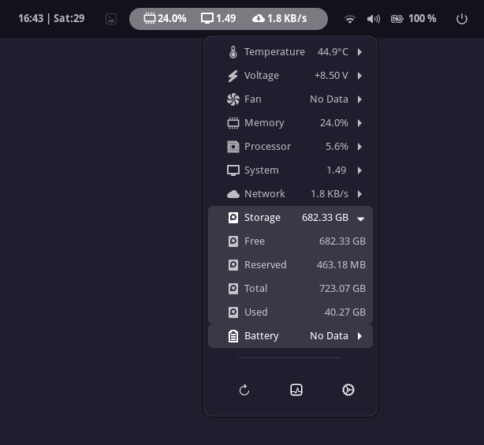
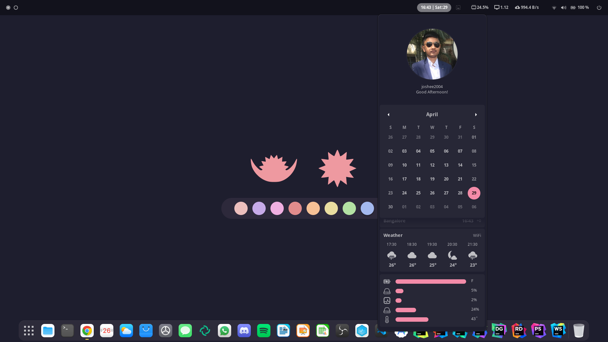
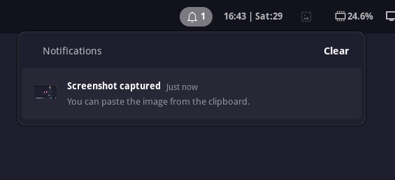
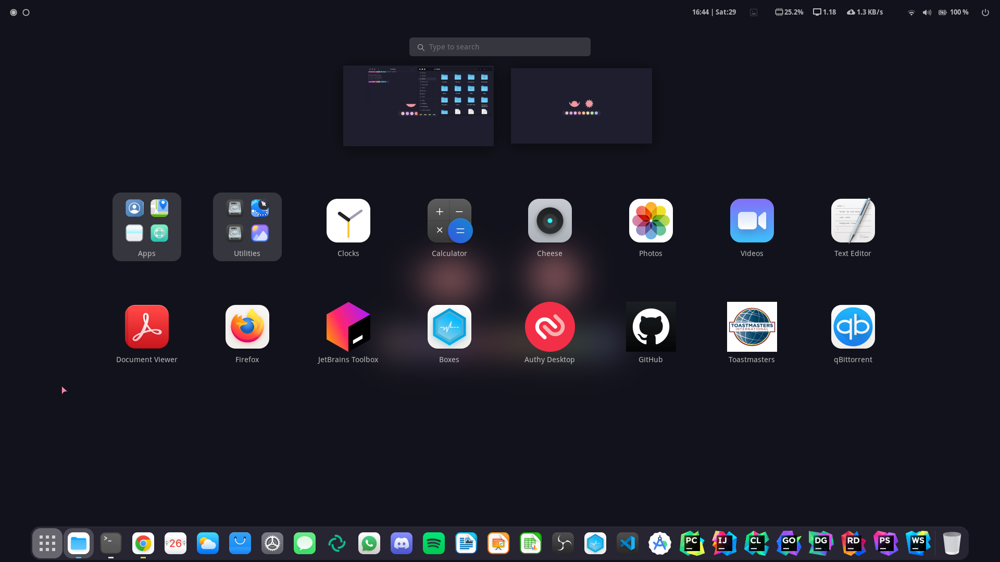

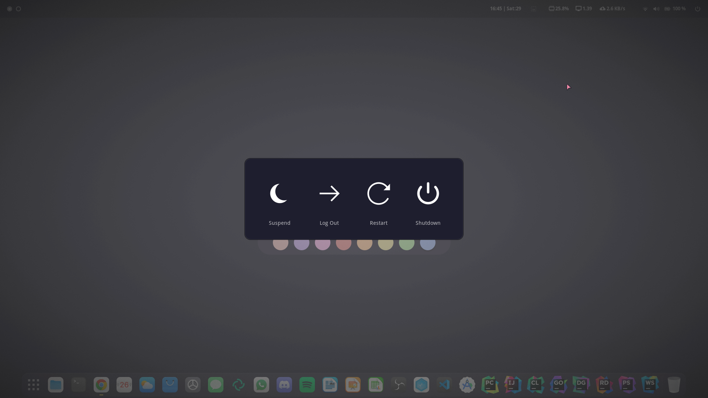

## bspwm

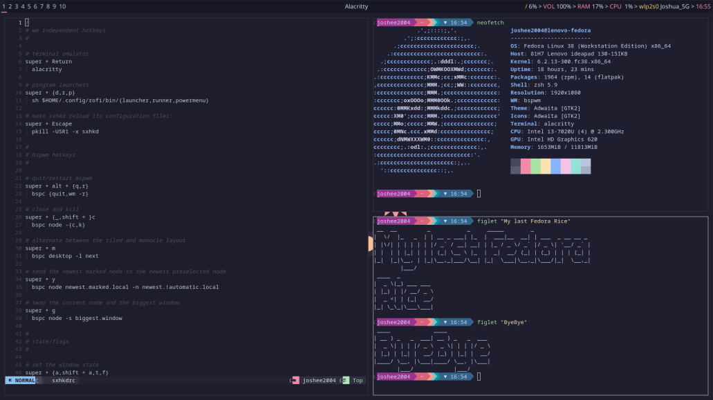
